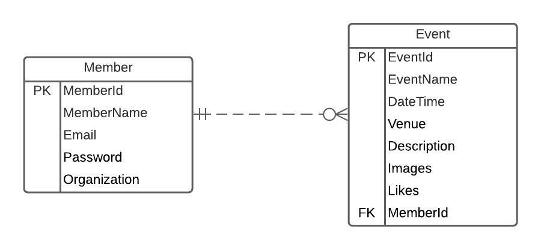
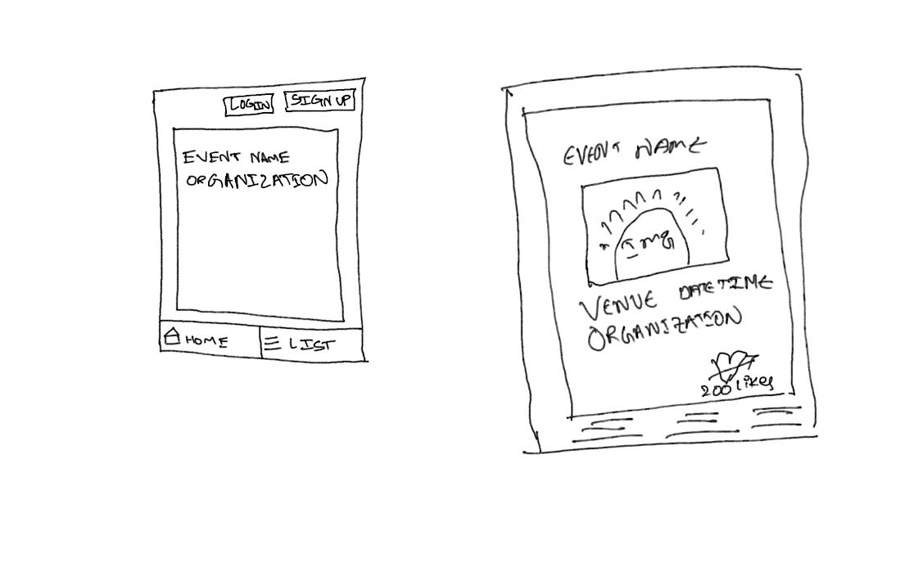
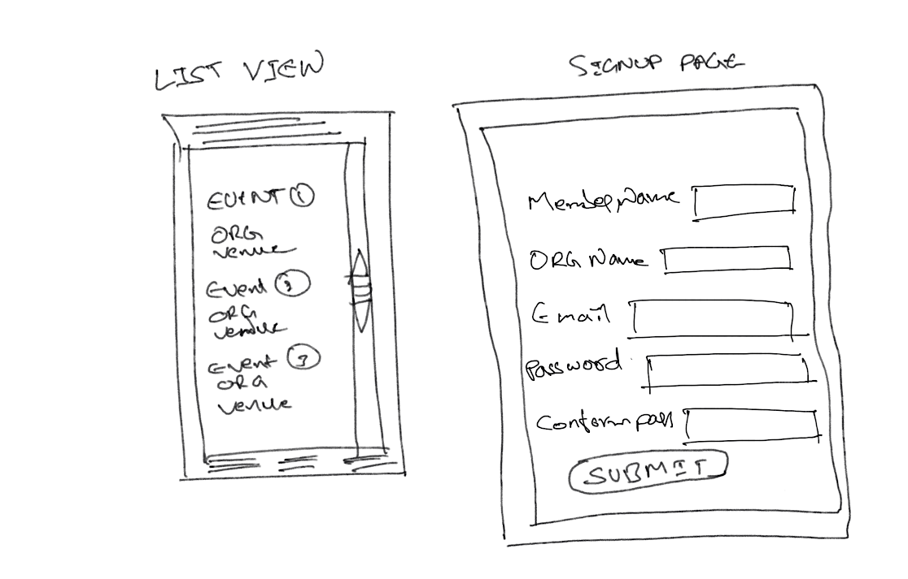
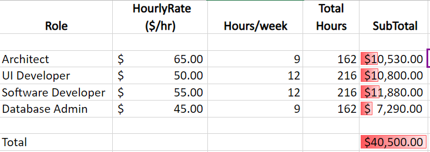

# RFP - Bearcat Events

## Statement of Purpose

As Students of Northwest Missouri State University are back to in-person classes, we would like to create an application that reminds students about the events happening in the University. The events can be from any Organization in the university like SAC, ISO, ACM, ISA etc. The main purpose of this application is to encourage students to participate in all events.

## Vision

We would like to create an Event Reminder Progressive Web Application that can be viewed on any  device. The app would let the users to add, update and Delete Events. There are various student organizations in Northwest. Each student organization conducts various events during every semester. Our application integrates the events from this organizations into one platform where users can know about them. To add any Event, member must be signed up first. Each event has the date of event, organization name, event venue and images of the event. Each event is sorted by date and the number of likes from the users.

## Team Members
|Member| Role|
|:------|---:|
|[Pramod Reddy Gonegari](https://github.com/pramod096) | Product Owner
| [Narendra Kumar Gunturu](https://github.com/Narendra-kumar-Gunturu) | Executive Head
| [Narsing Rao Nikitha Madhari](https://github.com/NikithaMN-05) | Marketing Head
| [Abhilash Ramavaram](https://github.com/AbhiRam0099) | Financial Adviser

## Functional Requirements

Create a Progressive Web application with authentication and authorization.
The following roles are suggested:

 - User
 - Member

#### User Requirements

As a user, I want to see one event which is held in NWMSU.

1. The user needs to open the app.
1. Through User Interface user can be able to one the event which is added by the Members.
1. By clicking the list button, all the events scheduled in the next 3 days must be displayed.

As a user, I need complete information about the Event.

1. The user needs to select the Event.
1. User can be able to see the description about the specific Event.
1. Along with description user can see some pictures, venue name, date and time about the event.

As a user, I want to give the feedback about the event.

1. The User have to click on the specific event.
1. User can like or unlike the event.

As a user, I want to become a Member

1. The User needs to sign-Up using the sign-Up button in the home page.
1. In order to sign-Up the user must provide details like name, organization for which they are working, preferred username and password.
1. After signing up user will have credentials to login as a Member.

#### Member Requirements

As a member, I want to login into the application.

1. Every member has a unique username and password after signing up in the application.
1. If the member forget the password, they can reset the password using email.

As a member, I want to add the events.

1. Every member can create new events for their organization.
1. After the event is created the new event should be visible to all the users in the home page.

As a member, I want to modify the events.

1. The member an rename the name of the events.
1. The member can change the time of the events.
1. The member can modify the event venue.
1. The member can add or remove the images from the events.

 
As a member, I want to delete the events.

1. The member can delete any of their events permanently.

## Entities

- Member
    - MemberId / Integer
    - MemberName / String
    - Email / String
    - Password / String
    - Organization / String
    
    
 - Events
 
    - EventId / Integer
    - EventName / String
    - DateTime / DateTime
    - Venue/ String
    - Description / String
    - Images / Blob
    - Likes / Integer
    
[Sample Data](/Resources/SampleData.xlsx)

## ER Diagram

    
## Sketches

## Schedule:

| Duration               | Task                                                    |
| -----------------------| ------------------------------------------------------- |
|18/08/2021 - 24/10/2021|RFP, Requirements Gathering, Planning, Budget|
|25/10/2021 - 09/04/2022| Development & Testing |
|10/04/2022  - 17/04/2022| Release|

## Budget:

## Technology Stack

#### Frontend
* HTML
* CSS
* BootStrap
* VueJs

#### Backend
* .NET
* C#
